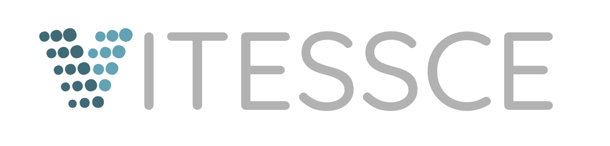

<a href="http://vitessce.io">
    
</a>

Visual Integration Tool for Exploration of Spatial Single-Cell Experiments

- [Latest release demo](http://vitessce.io/)
- [Previous demos](DEMOS.md)
- [Previous releases on NPM](https://www.npmjs.com/package/vitessce?activeTab=versions)


## Usage

Vitessce components can be used in React projects by installing the package from NPM:

```sh
npm install vitessce
```

For more details, please visit the [documentation](http://beta.vitessce.io/docs/).

## Development

First check your NodeJS version: It should work with NodeJS 8, 10, 12, 13, or 14.
```
$ node --version
v14.0.0
```

Note: NodeJS 14 may require the `max_old_space_size` option to be increased ([apparently due to a different heap management strategy](https://stackoverflow.com/a/59572966)):
```sh
export NODE_OPTIONS=--max_old_space_size=4096
```

Checkout the project, `cd`, and then:

```
$ npm install
$ npm start
```

The development server will refresh the browser as you edit the code.

- To run all the Travis checks: `./test.sh`
- To run just the unit tests: `npm run test:watch`

## Deployment

Before running any of the deployment scripts, confirm that you have installed the AWS CLI and are in the appropriate AWS account:
```
$ aws iam list-account-aliases --query 'AccountAliases[0]'
"gehlenborglab"
```

### Staging: Minimal Demo

To build the current branch and push the "minimal" demo site to S3, run this script:
```
$ ./push-demo.sh
```

This will build the demo, push to S3, and finally open the demo deployment in your browser.

### Release: Minimal Demo

If you haven't already, push a fresh demo site and
do a last [manual test](TESTING.md) of the deployment.
If it looks good, copy it to vitessce.io:

```
$ ./copy-prod.sh https://{url returned by push-demo.sh}
```

### Staging: App, Demos, and Docs

To build the current branch and push the public-facing docs/app/demo site to S3, run this script:
```
$ ./push-docs.sh
```

This will build the library and docs, push to S3, and finally open the docs deployment in your browser.

### Release: App, Demos, and Docs

If you haven't already, push a fresh docs site.
If it looks good, copy it to beta.vitessce.io:

```
$ ./copy-beta.sh https://{url returned by push-docs.sh}
```

### Release: NPM package

The `vitessce` package is published to the NPM registry by Travis when the version in `package.json` has been updated and pushed to the `master` branch. To perform this update:
- Check out a new branch for the release,
    - Update the CHANGELOG.md to remove the "in progress" text from the current version heading.
    - Update the version by running `npm version [major | minor | patch]` (note: this will add a git commit and a git tag).
- Make a pull request to merge from the release branch into `master`.

Travis uses the `NPM_EMAIL` and `NPM_TOKEN` variables that can be set using the [web interface](https://travis-ci.org/github/vitessce/vitessce/settings) (Settings -> Environment Variables).

## Related repositories

- [Viv](https://github.com/hms-dbmi/viv): A library for multiscale visualization of high-resolution multiplexed tissue data on the web.
- [HiGlass](https://github.com/higlass/higlass): A library for multiscale visualization of genomic data on the web.
- [vitessce-python](https://github.com/vitessce/vitessce-python): Python API and Jupyter widget.
- [vitessce-r](https://github.com/vitessce/vitessce-r): R API and R htmlwidget.
- [vitessce-data](https://github.com/hms-dbmi/vitessce-data): Scripts to generate sample data

## Old Presentations

- [January 2021: Ilan Gold's lab meeting update](https://docs.google.com/presentation/d/10kmjLxQh5ji-4TVMq06KRpXek3uje_fQpTXBqjFj0p4/edit?usp=sharing)
- [December 2020: Mark Keller's lab meeting update](https://docs.google.com/presentation/d/1rG0s5eH_NrFSk3_7lpmc9dsaUPFvnakYD59ff9D-G1M/edit?usp=sharing)
- [November 2020: Ilan Gold's lab meeting update](https://docs.google.com/presentation/d/1egAwCR8UwdRCWiGYVRelebwNDH9boBX1nJIX5auvf1w/edit?usp=sharing)
- [October 2020: Mark Keller's lab meeting update](https://docs.google.com/presentation/d/1M8dGbIGA_cfa3uZnGLnk3iMzMNVbxzza33OKBqwwlNQ/edit?usp=sharing)
- [July 2020: Ilan Gold's lab meeting update](https://docs.google.com/presentation/d/1QzKYP6sXPefBMNfY4PW4H0AMoWVbw9HeNoweLmJg17Y/edit?usp=sharing)
- [June 2020: NLM Informatics Training Conference (Trevor)](https://docs.google.com/presentation/d/1eYslI4y1LbnEGwj4XHXxqYcRKpYgqc9Y2mZTd5iCzMc/edit?usp=sharing)
- [May 2020: Trevor Manz's overview of multimodal imaging in Vitessce](https://docs.google.com/presentation/d/1NPYZPduymN7wzgN-NYRQwd15D-nUZYILJTgBR2oNb04/edit?usp=sharing)
- [January 2020: Ilan Gold's overview of IF Imagery](https://docs.google.com/presentation/d/1BSz2JefN2WSF_RwVpOrIhYD2V8D7ZLc5b21VTy2Xmlo/edit#slide=id.p)
- [January 2020: Trevor Manz's wrap-up on Arrow, Zarr, and IMS](https://docs.google.com/presentation/d/1H2hff-bW4SZ3KFD5_q0iN-Dv1yew7pVe0MbdMsA2gko/edit)
- [September 2019: HuBMAP Poster](https://drive.google.com/open?id=1pRiTN99-wZ6QuEMWzorcD4fA2Fi-7eW4)
- [August 2019: SIBMI Presentations](https://docs.google.com/presentation/d/1IRWDofdvKS3qbLY-s0a1EUijha3m-JopMYgmETOIHq0/edit?usp=sharing)
- [July 2019: Intern progress reports and HuBMAP collaboration](https://docs.google.com/presentation/d/10zanc_cHh-OcFvBeuJdKBpLnazjVh64pbbdD4kJQ7GY/edit?usp=sharing)
- [May 2019: Harvard IT Summit](https://docs.google.com/presentation/d/1eYDMedzhQtcClB2cIBo17hlaSSAu_-vzkG4LY_mGGQ8/edit#slide=id.p)
- [May 2019: Misc. tools](https://docs.google.com/presentation/d/1TaC68-r6bosnwi05BZ5bNh9tzeXsxyqmBo1gFZDxhGM/edit#slide=id.p)
- [April 2019: Software engineering](https://docs.google.com/presentation/d/1uW3J83LYaa67M9ZKe15AQw_h06QiFJBzpBickbRFcCY/edit#slide=id.p)
